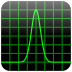

#  FFTS [](https://travis-ci.org/billthefarmer/ffts-android)

This is a fork of the [FFST project](https://github.com/anthonix/ffts)
for Android. I was unable to get this to build using the android build
script provided, and rather than waste time and effort investigating
the arcane autoconf/automake build system, moved the folders about so
that it can be built with the Android NDK build script.

The [app](https://github.com/billthefarmer/scope) that I want to use
it for is on [FDroid](https://f-droid.org), so it should be buildable
with the standard Android tools. Apps on this free app store are built
and signed by themselves using their Android based build system.

I have set up Android.mk to build a vfp version as the 'armeabi-v7a'
ABI does not guarantee NEON support. The following code snippet from
the NDK docs
([CPU ARM Neon](http://www.kandroid.org/ndk/docs/CPU-ARM-NEON.html))
shows how to test:
```c
    #include <cpu-features.h>
    ...
    ...
    if (android_getCpuFamily() == ANDROID_CPU_FAMILY_ARM &&
        (android_getCpuFeatures() & ANDROID_CPU_ARM_FEATURE_NEON) != 0)
    {
        // use NEON-optimized routines
        ...
    }
    else
    {
        // use non-NEON fallback routines instead
        ...
    }
```
However, the code structure is built around the autoconf/automake
premise that you build your library for your proposed use, rather than
build it to cope with different ARM processors. I've got around this
by building two libraries and determining which to load at run
time. This requires a third library just to check the processor.

The app runs the native test code. The printf function calls have been
changed to log the results using macros and the android logging api. I
have added code to dynamically load the relevent library for the
processor.

#### Moto G
	NEON processor
    ------+-----------+-------------
     Sign |      Size |     L2 Error
    ------+-----------+-------------
      -1  |         2 | 8.659561E-17
      -1  |         4 | 1.145552E-16
      -1  |         8 | 1.210162E-08
      -1  |        16 | 2.220916E-08
      -1  |        32 | 2.396272E-08
      -1  |        64 | 2.272872E-08
      -1  |       128 | 1.940460E-08
      -1  |       256 | 2.081312E-08
      -1  |       512 | 2.045939E-08
      -1  |      1024 | 2.079071E-08
      -1  |      2048 | 2.074052E-08
      -1  |      4096 | 2.124981E-08
      -1  |      8192 | 2.086463E-08
      -1  |     16384 | 2.071494E-08
      -1  |     32768 | 2.062090E-08
      -1  |     65536 | 2.054694E-08
      -1  |    131072 | 2.060355E-08
      -1  |    262144 | 2.054523E-08
       1  |         2 | 8.659561E-17
       1  |         4 | 1.145552E-16
       1  |         8 | 1.210162E-08
       1  |        16 | 2.220916E-08
       1  |        32 | 2.396272E-08
       1  |        64 | 2.272872E-08
       1  |       128 | 1.940460E-08
       1  |       256 | 2.081312E-08
       1  |       512 | 2.045939E-08
       1  |      1024 | 2.079071E-08
       1  |      2048 | 2.074052E-08
       1  |      4096 | 2.124981E-08
       1  |      8192 | 2.086463E-08
       1  |     16384 | 2.071494E-08
       1  |     32768 | 2.062090E-08
       1  |     65536 | 2.054694E-08
       1  |    131072 | 2.060355E-08
       1  |    262144 | 2.054523E-08
    ------+-----------+-------------
    
#### Nexus 7
	NEON processor
	------+-----------+-------------
     Sign |      Size |     L2 Error
    ------+-----------+-------------
      -1  |         2 | 8.659561E-17
      -1  |         4 | 1.145552E-16
      -1  |         8 | 1.210162E-08
      -1  |        16 | 2.220916E-08
      -1  |        32 | 2.396272E-08
      -1  |        64 | 2.272872E-08
      -1  |       128 | 1.940460E-08
      -1  |       256 | 2.081312E-08
      -1  |       512 | 2.045939E-08
      -1  |      1024 | 2.079071E-08
      -1  |      2048 | 2.074052E-08
      -1  |      4096 | 2.124981E-08
      -1  |      8192 | 2.086463E-08
      -1  |     16384 | 2.071494E-08
      -1  |     32768 | 2.062090E-08
      -1  |     65536 | 2.054694E-08
      -1  |    131072 | 2.060355E-08
      -1  |    262144 | 2.054523E-08
       1  |         2 | 8.659561E-17
       1  |         4 | 1.145552E-16
       1  |         8 | 1.210162E-08
       1  |        16 | 2.220916E-08
       1  |        32 | 2.396272E-08
       1  |        64 | 2.272872E-08
       1  |       128 | 1.940460E-08
       1  |       256 | 2.081312E-08
       1  |       512 | 2.045939E-08
       1  |      1024 | 2.079071E-08
       1  |      2048 | 2.074052E-08
       1  |      4096 | 2.124981E-08
       1  |      8192 | 2.086463E-08
       1  |     16384 | 2.071494E-08
       1  |     32768 | 2.062090E-08
       1  |     65536 | 2.054694E-08
       1  |    131072 | 2.060355E-08
       1  |    262144 | 2.054523E-08
    ------+-----------+-------------
    
#### Nexus 10
	NEON processor
	------+-----------+-------------
     Sign |      Size |     L2 Error
    ------+-----------+-------------
      -1  |         2 | 8.659561E-17
      -1  |         4 | 1.145552E-16
      -1  |         8 | 1.210162E-08
      -1  |        16 | 2.220916E-08
      -1  |        32 | 2.396272E-08
      -1  |        64 | 2.272872E-08
      -1  |       128 | 1.940460E-08
      -1  |       256 | 2.081312E-08
      -1  |       512 | 2.045939E-08
      -1  |      1024 | 2.079071E-08
      -1  |      2048 | 2.074052E-08
      -1  |      4096 | 2.124981E-08
      -1  |      8192 | 2.086463E-08
      -1  |     16384 | 2.071494E-08
      -1  |     32768 | 2.062090E-08
      -1  |     65536 | 2.054694E-08
      -1  |    131072 | 2.060355E-08
      -1  |    262144 | 2.054523E-08
       1  |         2 | 8.659561E-17
       1  |         4 | 1.145552E-16
       1  |         8 | 1.210162E-08
       1  |        16 | 2.220916E-08
       1  |        32 | 2.396272E-08
       1  |        64 | 2.272872E-08
       1  |       128 | 1.940460E-08
       1  |       256 | 2.081312E-08
       1  |       512 | 2.045939E-08
       1  |      1024 | 2.079071E-08
       1  |      2048 | 2.074052E-08
       1  |      4096 | 2.124981E-08
       1  |      8192 | 2.086463E-08
       1  |     16384 | 2.071494E-08
       1  |     32768 | 2.062090E-08
       1  |     65536 | 2.054694E-08
       1  |    131072 | 2.060355E-08
       1  |    262144 | 2.054523E-08
    ------+-----------+-------------
